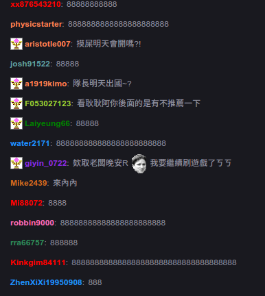
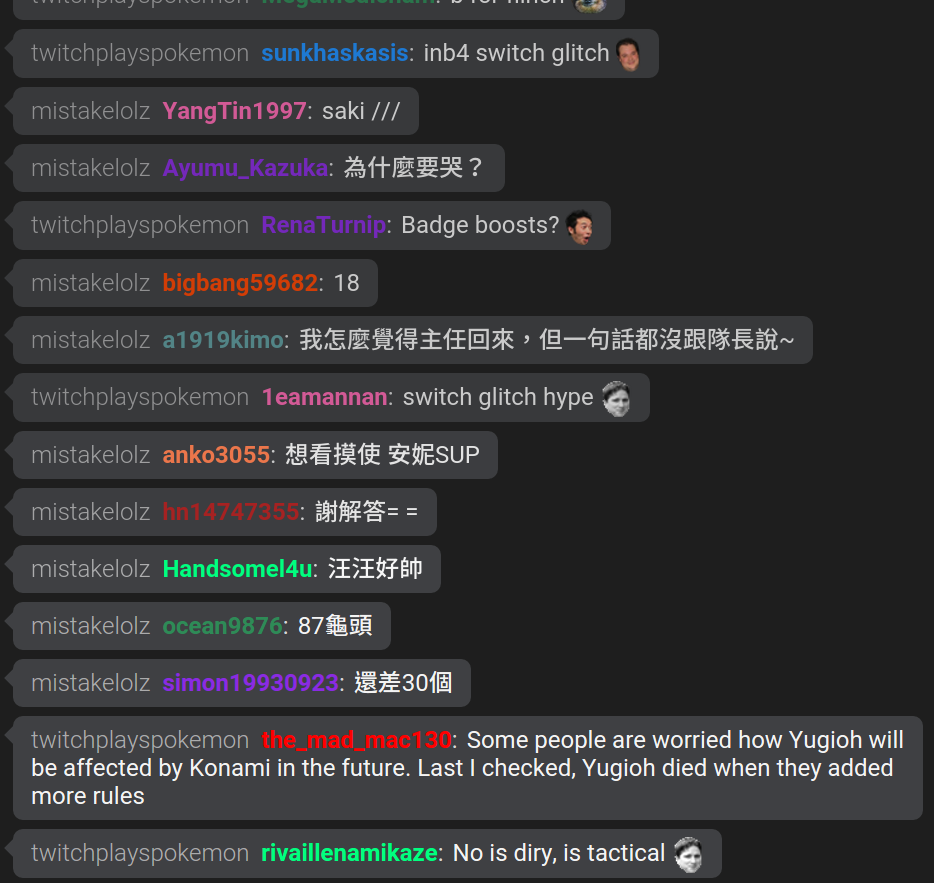
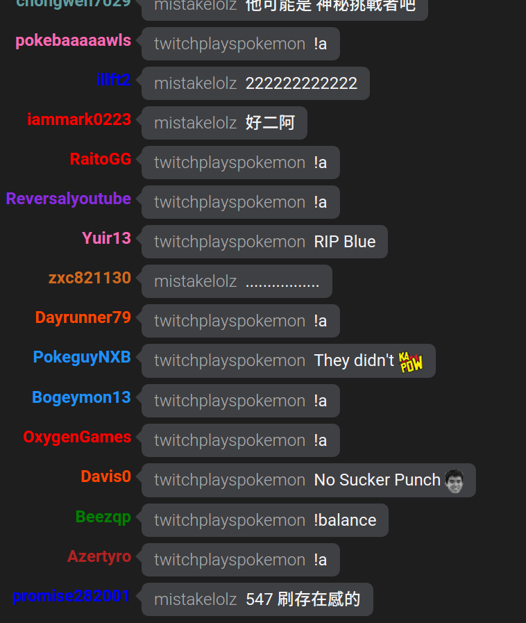
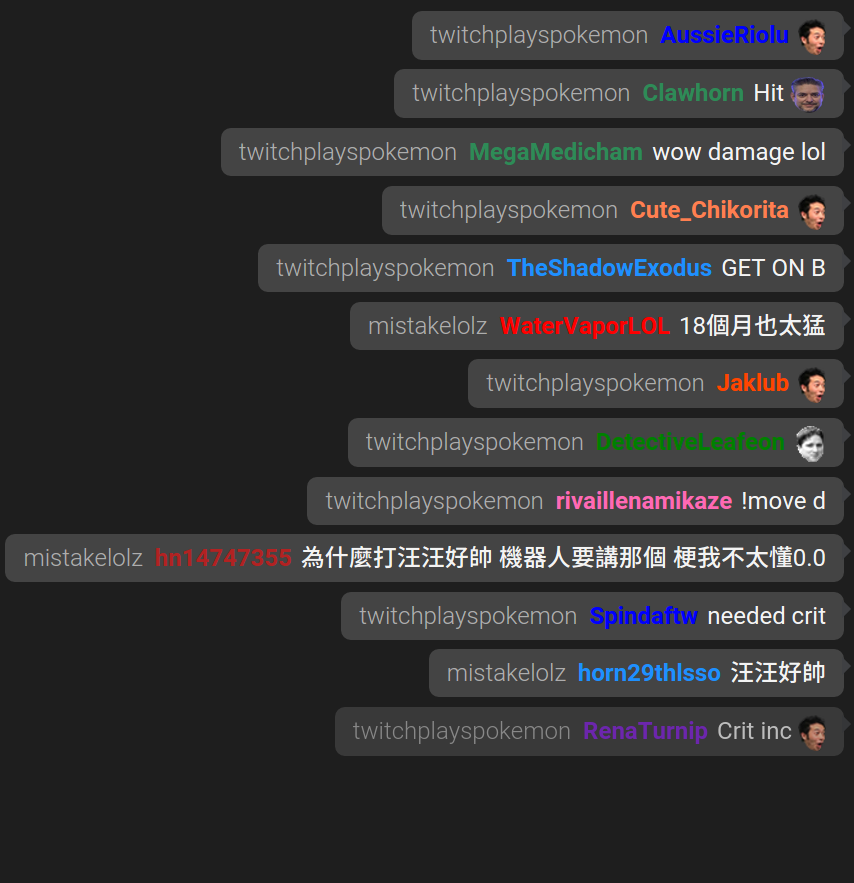
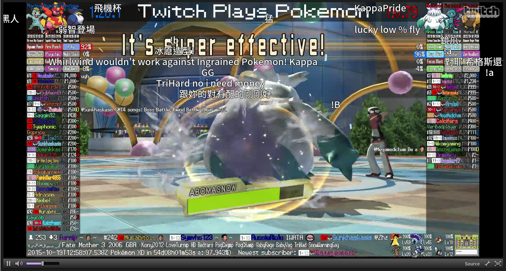

# Twitch 聊天彈幕 (chatfall/marquee)

Twitch 聊天訊息彈幕面板。類似 bilibili, niconico 影音網站的彈幕功能。讓你方便地將彈幕面板即時合成到你的實況影片。


網址參數寫上台名，例如: twitchplayspokemon 台名： http://twitchat.github.io/?channel=twitchplayspokemon

* 目前彈幕背景 Color key: `1e1e1e` 就可背景透明了

## 範例影片 Demo Video

* https://youtu.be/lmmO6zVhh1o

## 開發 Development

Dependencies:

* CommentCoreLibrary (https://github.com/jabbany/CommentCoreLibrary)
* tmi.js (https://github.com/Schmoopiie/tmi.js)

流程 Flow:

Initialize comment manager by CommentCoreLibrary:

```js
// ref. https://github.com/jabbany/CommentCoreLibrary/blob/master/docs/Intro.md#调用api函数-api-calls
var CM = new CommentManager($('#danmu'));
CM.init();
CM.start();
window.CM = CM; // global
```

Send twitch chat as chatfall by tmi.js:

```js
// ref. http://www.tmijs.org/docs/Events.md#chat
// old: client.addListener('message', function (channel, user, message, self) {});
client.on("chat", function (channel, user, message, self) {
    var danmaku = {
        "mode": 1,
        "text": message,
        "stime": 0,
        "size": 25,
        "color": 0xffffff,
        "dur": 10000
    };
    CM.send(danmaku);
});
```

## FAQ

* Twitch 暗色聊天室背景 Color key: 19191e

## Bonus

氣泡面板 Chat widget:

原本：



v1：



v2：



* http://twitchat.github.io/chat.html?channel=twitchplayspokemon

通知面板 Notication widget (訊息會一段時間自動消失):



* Live: http://twitchat.github.io/notify.html?channel=twitchplayspokemon
* Demo Video: https://youtu.be/LIRVj18cHwk

彈幕面板 chatfall/marquee player:



* twitchplayspokemon: 僅彈幕 suptitle only: http://twitchat.github.io/?channel=twitchplayspokemon
* twitchplayspokemon: 播放器+彈幕 player with suptitle: http://twitchat.github.io/twitchplayspokemon-player.html?channel=twitchplayspokemon
* mistakelolz: 僅彈幕 suptitle only: http://twitchat.github.io/?channel=mistakelolz
* mistakelolz: 播放器+彈幕 player with suptitle: http://twitchat.github.io/mistakelolz-player.html?channel=mistakelolz
* mistakelolz: 谷歌姊+播放器+彈幕 player with suptitle: http://twitchat.github.io/mistakelolz-player-tts.html?channel=mistakelolz

## TODO

聊天訊息：

* 彈幕面板
* 氣泡面板
* 通知面板
* 捧讀 (google sister)
* 紀錄歷史訊息
* 字幕面板
* 效果字幕
* 聊天訊息可指定相對位置 中、上、下、左
* 聊天室支援觀眾頭像
* 聊天室顯示逗留時間
* 聊天室顯示新人
* 聊天可指定訊息顏色
* mod 支援播放罐頭音效
* 支援投幣/承包/捐款功能
* 支援投票功能
* 彈幕透過指令發送，且可限制 mod 才能發送
* 將聊天訊息整理連結列表

關注：

* 通知面板
* 動畫
* 捧讀 (google sister)

贊助：

* 通知面板
* 動畫
* 捧讀 (google sister)

統計：

* 每x/最多發言次數
* 每x/最多發言字數
* 每x/熱門關鍵字/詞句
* 每x/最多贊助金額

* Wavefrom bar
* Click zoom out / highlight chat
* 依人合併聊天訊息

* 開台行事曆 以及達成率/缺席率
* 私訊功能
* 留言板功能
* 觀賞 VOD 可補彈幕與聊天訊息，需要區分即時訊息還是老訊息

## ref.

* https://github.com/jabbany/CommentCoreLibrary
* https://github.com/SunnyLi/CommentCorePlayer
* https://github.com/chiruom/jquery.danmu.js
* https://github.com/jabbany/ABPlayerHTML5
* https://www.reddit.com/r/youtubegaming/comments/4kibiw/api_reading_live_chat_messages_from_javascript/

## firebase scripts

~/.firebase/config.json:

```json
{
    "fffffff": {
        "secret": "fffffffffffffffffffffffffffffffffffffffff",
        "users": {
            "root": {
                "token": "fffffffffffffffffffffffffffffffffffff"
            }
        },
        "url": "https://fffffff.firebaseio.com/"
    }
}
```

## LICENSE

Copyright 2015 Andrew Chen

Licensed under the Apache License, Version 2.0 (the "License"); you may not use this file except in compliance with the License. You may obtain a copy of the License at

http://www.apache.org/licenses/LICENSE-2.0

Unless required by applicable law or agreed to in writing, software distributed under the License is distributed on an "AS IS" BASIS, WITHOUT WARRANTIES OR CONDITIONS OF ANY KIND, either express or implied. See the License for the specific language governing permissions and limitations under the License.
