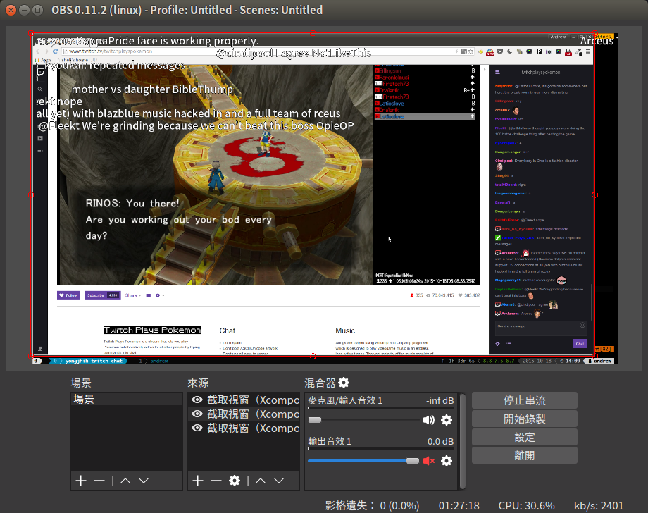

# Twitch Chat Suptitle

Twitch 聊天訊息彈幕面板。類似 bilibili, niconico 影音網站的彈幕功能。讓你方便地將彈幕面板即時合成到你的實況影片。



網址參數寫上台名，例如: twitchplayspokemon 台名： http://twitchat.github.io/?channel=twitchplayspokemon

* 目前彈幕背景 Color key: `1e1e1e` 就可背景透明了

## 範例影片 Demo Video

* https://youtu.be/lmmO6zVhh1o

## 開發 Development

Dependencies:

* CommentCoreLibrary (https://github.com/jabbany/CommentCoreLibrary)
* tmi.js (https://github.com/Schmoopiie/tmi.js)

流程 Flow:

Initialize comment manager by CommentCoreLibrary:

```js
// ref. https://github.com/jabbany/CommentCoreLibrary/blob/master/docs/Intro.md#调用api函数-api-calls
var CM = new CommentManager($('#danmu'));
CM.init();
CM.start();
window.CM = CM; // global
```

Send twitch chat as suptitle by tmi.js:

```js
// ref. http://www.tmijs.org/docs/Events.md#chat
// old: client.addListener('message', function (channel, user, message, self) {});
client.on("chat", function (channel, user, message, self) {
    var danmaku = {
        "mode": 1,
        "text": message,
        "stime": 0,
        "size": 25,
        "color": 0xffffff,
        "dur": 10000
    };
    CM.send(danmaku);
});
```

## Live Demo

* twitchplayspokemon: 僅彈幕 suptitle only: http://twitchat.github.io/?channel=twitchplayspokemon
* twitchplayspokemon: 播放器+彈幕 player with suptitle: http://twitchat.github.io/twitchplayspokemon-twitch.html?channel=twitchplayspokemon
* mistakelolz: 僅彈幕 suptitle only: http://twitchat.github.io/?channel=mistakelolz
* mistakelolz: 播放器+彈幕 player with suptitle: http://twitchat.github.io/mistakelolz-twitch.html?channel=mistakelolz

## FAQ

* Twitch 暗色聊天室背景 Color key: 19191e

## TODO

聊天訊息：

* 彈幕面板
* 氣泡面板
* 通知面板
* 捧讀 (google sister)
* 紀錄

關注：

* 通知面板
* 動畫
* 捧讀 (google sister)

贊助：

* 通知面板
* 動畫
* 捧讀 (google sister)

統計：

* 每x/最多發言次數
* 每x/最多發言字數
* 每x/熱門關鍵字/詞句
* 每x/最多贊助金額

## ref.

* https://github.com/jabbany/CommentCoreLibrary
* https://github.com/SunnyLi/CommentCorePlayer
* https://github.com/chiruom/jquery.danmu.js
* https://github.com/jabbany/ABPlayerHTML5

## LICENSE

Copyright 2015 Andrew Chen

Licensed under the Apache License, Version 2.0 (the "License"); you may not use this file except in compliance with the License. You may obtain a copy of the License at

http://www.apache.org/licenses/LICENSE-2.0

Unless required by applicable law or agreed to in writing, software distributed under the License is distributed on an "AS IS" BASIS, WITHOUT WARRANTIES OR CONDITIONS OF ANY KIND, either express or implied. See the License for the specific language governing permissions and limitations under the License.
